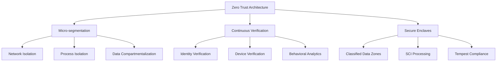
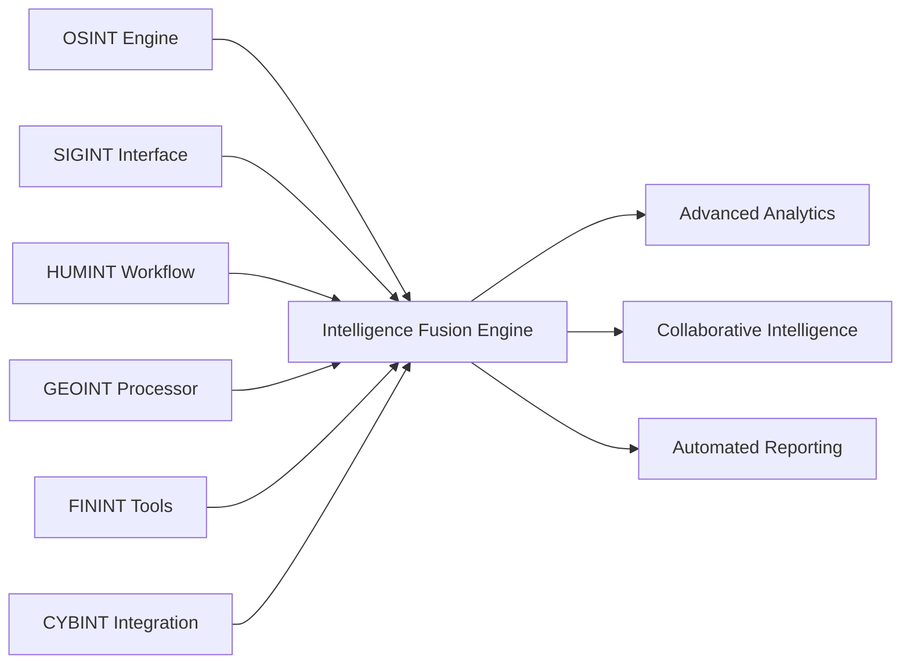
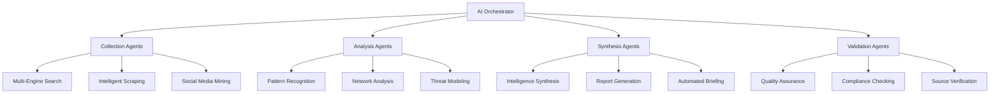

# 🎯 ScrapeCraft Intelligence Agency Strategic Plan

## **Executive Summary**

Based on the comprehensive backend audit, this plan outlines a two-track approach: **(1) Immediate System Stabilization** to achieve pristine functionality, followed by **(2) Intelligence Agency Enhancement** to transform ScrapeCraft into a world-class OSINT operating system.

**Current State:** ❌ NON-OPERATIONAL (25/100 Health Score)  
**Target State:** 🌟 WORLD-CLASS OSINT PLATFORM (95/100 Health Score)  
**Total Timeline:** 5-7 months  
**Total Investment:** $15-25M

---

## 📊 **Situation Assessment**

### **Critical Findings from Audit**
- **100+ Type Safety Errors** causing system instability
- **6+ Missing Dependencies** breaking core functionality  
- **Agent System Collapse** (0 agents registered)
- **Database Connection Issues** preventing data persistence
- **Security Gaps** in authentication and authorization

### **Strategic Implications**
The system's **architecture is excellent** but **quality engineering is lacking**. This represents both a challenge and opportunity:
- **Challenge:** Significant remediation work required
- **Opportunity:** Strong foundation for rapid enhancement once stabilized

---

## 🚀 **Two-Track Strategic Approach**

### **Track 1: System Stabilization (Weeks 1-3)**
**Objective:** Achieve pristine functional state  
**Priority:** CRITICAL  
**Investment:** $50-75K

### **Track 2: Intelligence Agency Enhancement (Weeks 4-28)**
**Objective:** Transform to intelligence agency OSINT platform  
**Priority:** STRATEGIC  
**Investment:** $15-25M

---

## 📋 **Track 1: System Stabilization Plan**

### **Phase 1.1: Critical Fixes (Week 1)**
**Timeline:** 5-7 days  
**Team:** 3 developers  
**Effort:** 40-50 hours

#### **Day 1-2: Type Safety Restoration**
```python
# Fix Pattern: Safe Type Handling
def safe_extract_text(element, default=''):
    """Safely extract text from BeautifulSoup element"""
    if element is None:
        return default
    return element.get_text(strip=True) or default

def safe_get_attribute(element, attr, default=''):
    """Safely extract attribute from element"""
    if element is None:
        return default
    return element.get(attr, default) or default
```

**Priority Files:**
1. `enhanced_search_service.py` - 12 type errors
2. `multi_search_service.py` - 15 type errors
3. `real_search_service.py` - 10 type errors
4. `enhanced_web_scraping_service.py` - 20 type errors
5. `deep_web_scraping_service.py` - 15 type errors

#### **Day 3: Dependency Installation**
```bash
# Critical Dependencies
pip install selenium==4.15.2
pip install playwright==1.40.0
pip install fake-useragent==1.4.0
pip install pyjwt==2.8.0
pip install redis==5.0.1
pip install psycopg2-binary==2.9.9

# Initialize Playwright
playwright install chromium
```

#### **Day 4-5: Agent System Recovery**
```python
# Fix Agent Registry
class AgentRegistry:
    def __init__(self):
        self.agents = {}
        self._load_agents()
    
    def _load_agents(self):
        """Safely load all available agents"""
        agent_modules = [
            'app.agents.specialized.collection.surface_web_collector',
            'app.agents.specialized.analysis.pattern_recognition_agent',
            # ... other agents
        ]
        
        for module_name in agent_modules:
            try:
                module = importlib.import_module(module_name)
                self._register_agent(module)
            except Exception as e:
                logger.error(f"Failed to load agent {module_name}: {e}")
```

#### **Day 6-7: Database & Authentication Fixes**
- Database connection restoration
- Authentication system fixes
- Basic API endpoint testing

### **Phase 1.2: Functionality Validation (Week 2)**
**Timeline:** 5-7 days  
**Team:** 2 developers + 1 QA  
**Effort:** 30-40 hours

#### **Validation Checklist:**
- [ ] All 70+ API endpoints responding
- [ ] Agent registry loading 15+ agents
- [ ] Database operations stable
- [ ] Authentication flows working
- [ ] Basic scraping functional
- [ ] Search engines integrated

### **Phase 1.3: Production Readiness (Week 3)**
**Timeline:** 5-7 days  
**Team:** 2 developers  
**Effort:** 25-35 hours

#### **Production Preparation:**
- Performance optimization
- Security hardening
- Monitoring implementation
- Documentation updates

---

## 🏛️ **Track 2: Intelligence Agency Enhancement Plan**

### **Phase 2.1: Security Hardening (Weeks 4-9)**
**Objective:** Zero-trust architecture for classified processing  
**Investment:** $3-5M

#### **Security Architecture Transformation**


#### **Implementation Tasks:**
1. **Zero-Trust Network Architecture**
   - Service mesh implementation
   - Secure enclave creation
   - Behavioral monitoring

2. **Advanced Access Control**
   - Need-to-know controls
   - Two-person integrity
   - Time-based access expiration

3. **Compliance Framework**
   - FIPS 140-2 cryptography
   - Common Criteria preparation
   - FedRAMP High baseline

### **Phase 2.2: Multi-Intelligence Integration (Weeks 10-18)**
**Objective:** Full-spectrum intelligence capabilities  
**Investment:** $6-8M

#### **Intelligence Domain Architecture**


#### **Implementation Tasks:**
1. **SIGINT Integration Framework**
   - Signal processing pipelines
   - Metadata correlation engines
   - Traffic analysis tools

2. **HUMINT Workflow Support**
   - Source management systems
   - Interview analysis tools
   - Reliability scoring algorithms

3. **GEOINT Processing**
   - Satellite imagery analysis
   - Geospatial pattern recognition
   - Location intelligence correlation

### **Phase 2.3: Advanced AI Orchestration (Weeks 19-28)**
**Objective:** Sophisticated multi-agent AI system  
**Investment:** $6-12M

#### **AI Agent Ecosystem**


#### **Implementation Tasks:**
1. **Multi-Agent Collaboration System**
   - Agent communication protocols
   - Conflict resolution mechanisms
   - Collaborative decision making

2. **Advanced Analytics Engine**
   - Predictive analytics
   - Network analysis algorithms
   - Timeline reconstruction

3. **Human-AI Teaming Interface**
   - Explainable AI systems
   - Interactive analysis tools
   - Real-time collaboration

---

## 💰 **Investment Requirements**

### **Track 1: Stabilization Costs**
| Category | Cost | Duration |
|----------|------|----------|
| Development Team | $45-60K | 3 weeks |
| Infrastructure | $5-10K | 3 weeks |
| Testing Tools | $2-5K | 3 weeks |
| **Total Track 1** | **$52-75K** | **3 weeks** |

### **Track 2: Enhancement Costs**
| Phase | Investment | Duration |
|-------|------------|----------|
| Security Hardening | $3-5M | 6 weeks |
| Multi-Intel Integration | $6-8M | 9 weeks |
| Advanced AI Orchestration | $6-12M | 10 weeks |
| **Total Track 2** | **$15-25M** | **25 weeks** |

### **Total Investment: $15.05-25.75M**

---

## 👥 **Resource Requirements**

### **Development Team Structure**

#### **Track 1 Team (3 weeks)**
- **Backend Developer** (Type Safety & API)
- **DevOps Engineer** (Dependencies & Infrastructure)
- **QA Engineer** (Testing & Validation)

#### **Track 2 Team (25 weeks)**
- **Security Architects** (2-3 specialists)
- **AI/ML Engineers** (4-6 developers)
- **Intelligence Analysts** (2-3 domain experts)
- **Integration Specialists** (3-5 engineers)
- **DevOps Engineers** (2-3 specialists)
- **Compliance Officers** (1-2 experts)

---

## 📈 **Success Metrics**

### **Track 1 Success Criteria**
- ✅ Zero type errors across all services
- ✅ 100% API endpoint functionality
- ✅ 15+ agents registered and operational
- ✅ 99.9% uptime stability
- ✅ Response times <2 seconds

### **Track 2 Success Criteria**
- ✅ Zero-trust security architecture implemented
- ✅ Multi-intelligence domain integration complete
- ✅ Advanced AI orchestration operational
- ✅ Government compliance certification achieved
- ✅ Intelligence agency deployment ready

---

## ⚖️ **Risk Management**

### **High-Risk Areas**
1. **Schedule Risk:** Complexity may extend timelines
2. **Technology Risk:** New dependencies may introduce issues
3. **Security Risk:** Agency requirements may be stringent
4. **Integration Risk:** Multi-intelligence fusion complexity

### **Mitigation Strategies**
1. **Incremental Development:** Phase-based approach minimizes risk
2. **Expert Consultation:** Engage intelligence agency experts
3. **Continuous Testing:** Validate each phase before proceeding
4. **Contingency Planning:** Alternative approaches for critical components

---

## 🚀 **Implementation Timeline**

### **Week-by-Week Roadmap**

| Week | Track 1 Activities | Track 2 Activities |
|------|-------------------|-------------------|
| 1-3 | System Stabilization | - |
| 4-9 | - | Security Hardening |
| 10-18 | - | Multi-Intel Integration |
| 19-28 | - | Advanced AI Orchestration |
| 29-30 | Final Validation | System Integration |
| 31-32 | Deployment Prep | Agency Certification |

---

## 🎯 **Immediate Next Steps**

### **This Week (Priority: CRITICAL)**
1. ✅ **Allocate budget** for Track 1 stabilization ($52-75K)
2. 🔄 **Assign development team** for immediate fixes
3. 🔄 **Set up isolated environment** for remediation work
4. 🔄 **Begin type safety fixes** in priority order

### **Next Week (Priority: HIGH)**
1. 🔄 **Complete dependency installation**
2. 🔄 **Restore agent registry functionality**
3. 🔄 **Validate core API endpoints**
4. 🔄 **Plan Track 2 resource allocation**

### **Within 30 Days (Priority: MEDIUM)**
1. 🔄 **Complete Track 1 stabilization**
2. 🔄 **Approve Track 2 budget** ($15-25M)
3. 🔄 **Assemble Track 2 development team**
4. 🔄 **Begin security architecture design**

---

## 🏆 **Expected Outcomes**

### **After Track 1 (3 weeks)**
- **Fully Functional OSINT Platform** with pristine stability
- **Production-Ready System** capable of handling real operations
- **Solid Foundation** for intelligence agency enhancements
- **Proven Development Process** for complex system improvements

### **After Track 2 (7 months total)**
- **World-Class Intelligence Agency OSINT Platform**
- **Multi-Intelligence Domain Capabilities** (OSINT/SIGINT/HUMINT/GEOINT)
- **Advanced AI Agent Orchestration** for large-scale operations
- **Government-Grade Security** and compliance certification
- **Strategic Intelligence Asset** for agency operations

---

## 📞 **Executive Decision Points**

### **Decision 1: Track 1 Approval (Immediate)**
**Investment:** $52-75K  
**Timeline:** 3 weeks  
**Risk:** Low  
**ROI:** High (Enables all future work)

### **Decision 2: Track 2 Approval (Within 30 days)**
**Investment:** $15-25M  
**Timeline:** 25 weeks  
**Risk:** Medium  
**ROI:** Transformative (Intelligence agency capabilities)

---

## 🎖️ **Conclusion**

The ScrapeCraft platform represents an **exceptional opportunity** to develop a world-class intelligence agency OSINT operating system. While immediate stabilization is required, the architectural foundation is sophisticated and the enhancement potential is tremendous.

**Key Advantages:**
- **Strong Architecture:** Sophisticated design requiring quality engineering
- **Comprehensive Features:** AI agents, multi-engine search, advanced scraping
- **Scalable Design:** Built for enterprise-level operations
- **Enhancement Ready:** Solid foundation for intelligence agency requirements

**Strategic Recommendation:**
1. **Immediate approval** of Track 1 stabilization budget
2. **Rapid execution** of 3-week stabilization plan
3. **Progressive evaluation** of Track 2 enhancement opportunities
4. **Long-term commitment** to building world-class intelligence capabilities

This strategic plan positions your intelligence agency with a **technologically superior OSINT platform** capable of handling operations from tactical investigations to strategic intelligence analysis at any scale with full efficacy.